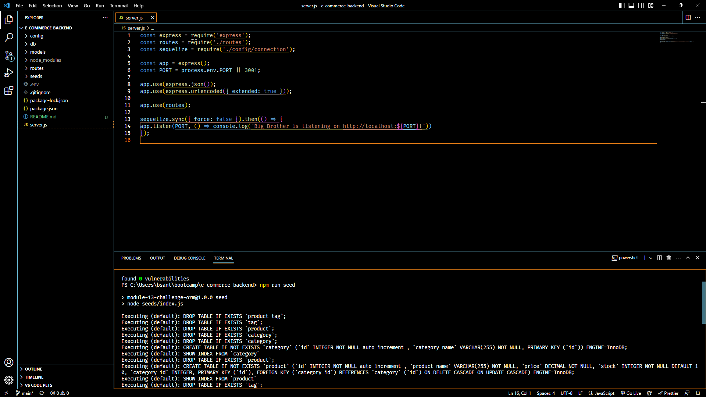

# E-Commerce Back End

## description
[Click this link to see this app in Action.](https://drive.google.com/file/d/1YZbfgFXjDn9leq0QHzkPcC4t4krJgJaA/view)
This is the database for an e-commerce website. It shows the functionality of a common back end using sequilize to manipulate the database that is created by mysql while also using dotenv to keep database credentials safe and express.js to create and use routes to use sequilize.

| Technology Used         | Resource URL           | 
| ------------- |:-------------:| 
| Javascript    | [https://developer.mozilla.org/en-US/docs/Web/JavaScript](https://developer.mozilla.org/en-US/docs/Web/JavaScript) | 
| Git | [https://www.w3schools.com/git/default.asp](https://www.w3schools.com/git/default.asp)     |
| express.js | [https://expressjs.com/](https://expressjs.com/)     |
| Sequilize    | [https://sequelize.org/docs/v6/](https://sequelize.org/docs/v6/) |   
| Insomnia | [https://docs.insomnia.rest/](https://docs.insomnia.rest/)     |

## Table of Contents 
 * [Installation](#installation)
* [Usage](#usage)
* [Credits](#credits)
* [Contributions](#contribution)
* [License](#license)
* [Testing](#Testing)
* [Questions](#questions)

## Installation 
### You will need to run a npm i to install the dependencies and have access to mysql shell to create the database.
 
## Usage 
 ### Through the mysql shell you will need to run the database file to create the database, then run the seeds file through node to populate the database. 
  
### After you run the server file by using npm start or node server.js you may use your browser to test the C.R.U.D operations though we use Insomnia to do this. 

 
## Credits 
All this coding made possible by [Jerome Chenette](https://github.com/jeromechenette) and my fellow students who help each other along the way## Contributions 
 n/a
## License 
 None
## Testing 
 Insomia or your local browser
## Questions 
 If you have any questions you can refer to my github at this link or email me! 
 * [Github](github.com/BrettSantor) 
* b.santor27@gmail.com